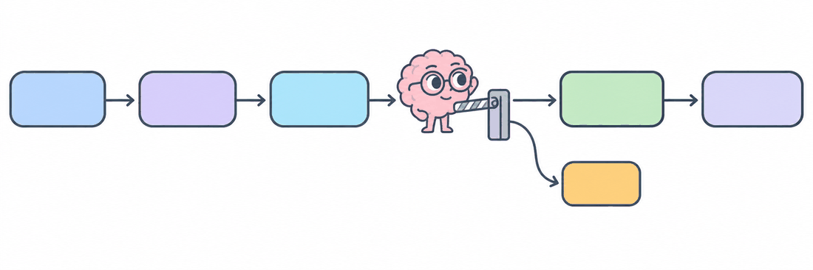
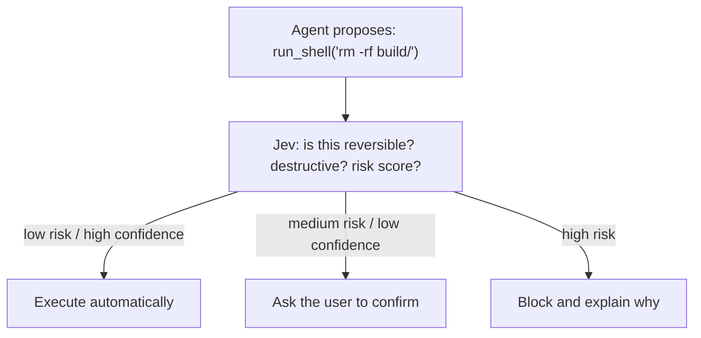
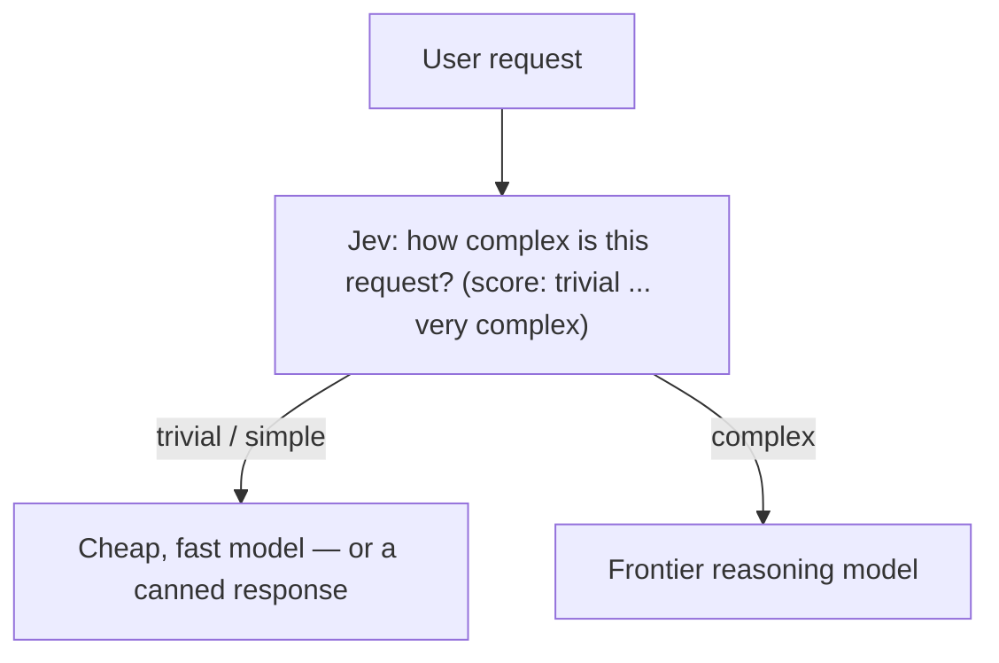
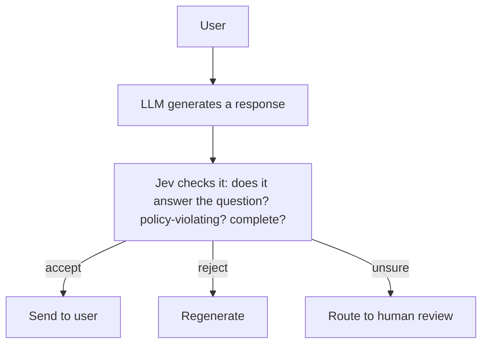

# Level 7 — Agent Loop Patterns

Now that you've seen a raw call and a head-to-head comparison, here are the
three patterns that keep showing up wherever people plug Jev into an actual
agent loop.

## Pattern 1 — Tool-call gating / guardrails

Before letting an agent execute a risky action (run a shell command, send an
email, move money), ask Jev to classify the *risk* of that specific action
given the current context, and gate execution on the answer.

LangChain's own middleware ecosystem has a concrete version of this:
`AutoModeMiddleware`, which sits in front of tool execution and uses Jev to
decide whether a proposed tool call should be allowed to run automatically
— the same "safe-mode" pattern used in agentic coding tools like Claude
Code, Codex, and Cursor, just implemented with a purpose-built decision
model instead of hand-written regexes.

**Try it:** `uv run` [`examples/07_tool_gate_demo.py`](../examples/07_tool_gate_demo.py)
— a tiny mock "shell tool" gated by a live Jev call.

## Pattern 2 — Model routing

Not every step of an agent's job needs a frontier model. `ModelRouterMiddleware`-style
patterns use Jev as the very first step: classify how hard the incoming
request actually is, then route accordingly.

This turns "always call the expensive model, just in case" into "call the
expensive model only when the cheap classifier says it's actually needed" —
a cost lever that compounds across thousands of requests.

## Pattern 3 — Output verification / LLM-as-a-gate

Instead of trusting an LLM's output blindly, or paying for a second LLM call
to "check the first one's work" (slow and expensive), use Jev as a fast
verification layer:

This is the same shape as Pattern 1, just applied to *generated text*
instead of *proposed tool calls* — Jev doesn't need to understand code or
shell syntax specifically, it just needs a clear state + a clear question.

## The common thread

All three patterns share the same skeleton: **an LLM (or the agent itself)
proposes something → Jev evaluates it against one or more typed questions →
code branches on the typed answer.** Jev never takes the action itself and
never generates the content itself — it's purely the decision point wedged
between "something was proposed" and "something happens."

Next: **[Level 8 — Confidence-Gated Decisions](08_confidence_gating_best_practices.md)**,
which covers the practical rules for writing good Jev questions and
composing multiple answers into a single decision.
