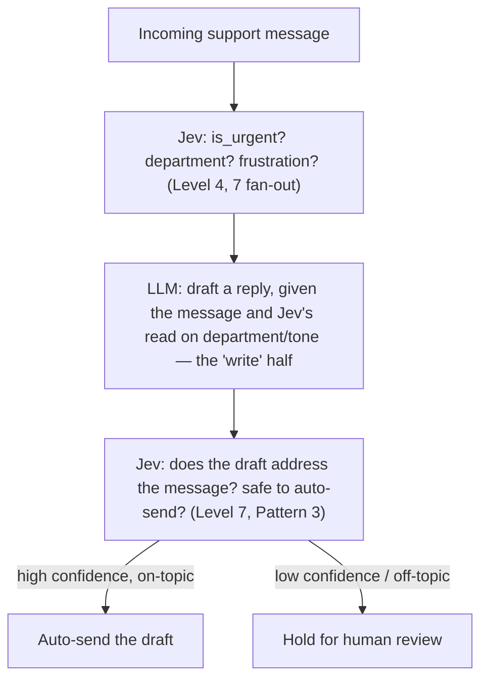

# Level 10 — Capstone: A Support-Ticket Triage Project


Everything from Levels 1–9, combined into one small pipeline — but this
level isn't just a script to read. It's structured like a real AI project,
because "call an LLM/Jev and print the result" and "ship something you'd
trust in production" are two different skills. This level teaches the
second one.

## The pipeline



This mirrors real production patterns: Jev handles every *decision* point
(triage in, verification out), the LLM handles the one part that genuinely
needs open-ended generation (the reply itself). Neither model does the
other's job.

## Why this isn't a single script anymore

Every other level in this course is one file, because the point was to
isolate one idea. A real project isn't one file, because it has to answer
questions a demo script never has to:

- Can someone change the confidence threshold without reading the whole
  file top to bottom to find it?
- If Jev or the LLM starts returning something slightly different, does
  something *tell you*, or does it fail silently in production?
- Can a teammate verify your change is correct without spending real
  API credits and waiting on network calls, every single time?

That's what the structure below buys you:

```
capstone/
├── client.py     # talks to Jev + the LLM — the only file that makes network calls
├── pipeline.py   # the business logic: triage, draft, verify, decide
└── cli.py        # the demo loop that prints results to your terminal
tests/
└── test_pipeline.py   # fast, free, deterministic — no network, no API key
evals/
├── golden_tickets.jsonl   # hand-labeled "correct" answers
└── run_eval.py            # slow, costs money, non-deterministic — measures quality
```

`examples/10_capstone_ticket_triage.py` still exists — it's now a two-line
shim that imports `capstone.cli.main`, so `uv run
examples/10_capstone_ticket_triage.py` keeps working exactly as before.
Everything worth reading moved into `capstone/`.

### Typed results instead of dicts

The earlier version of this level returned plain dicts from every function.
[`capstone/pipeline.py`](../capstone/pipeline.py) returns dataclasses
instead — `TriageResult`, `VerificationResult`, `TicketOutcome`. It's a
small change with a real payoff: `result.department` fails loudly at the
first typo (`AttributeError`), where `result["deprtment"]` fails loudly
too, but only at runtime, and only if that exact path gets exercised. With
a dataclass, your editor autocompletes the field names and a type checker
catches the typo before you ever run the code.

### The client is separated from the logic on purpose

[`capstone/client.py`](../capstone/client.py) holds the only two functions
that make network calls: `call_jev()` and `chat_complete()`.
[`capstone/pipeline.py`](../capstone/pipeline.py) imports them
(`from .client import call_jev, chat_complete`) and never calls
`requests` or `litellm` directly. This is the single decision that makes
the rest of this level possible — it's what lets a unit test swap in a
fake response instead of a real API call.

## Run it

```bash
uv run examples/10_capstone_ticket_triage.py
```

Watch the console output for each of the sample tickets: the triage
answers, the drafted reply, the verification check, and the final routing
decision (auto-send vs. hold for review). The drafting step uses
`CHAT_MODEL` from `.env` (default `gpt-4o-mini`) via LiteLLM — swap in any
provider you have a key for, see the README's "Bring Your Own Model"
section if you need a free one.

## Unit tests: fast, free, and they never call the real API

```bash
uv run pytest
```

Open [`tests/test_pipeline.py`](../tests/test_pipeline.py) alongside this.
Every test hands `pipeline.triage()` or `pipeline.verify_reply()` a *fake*
Jev response via `monkeypatch`, then asserts the function parsed it
correctly. No network call happens, no API key is needed, and the whole
suite runs in under two seconds — which means it can run on every save,
every commit, every pull request, forever, at zero cost.

There's a subtlety worth internalizing, because it trips up everyone the
first time: `pipeline.py` imports the client functions by name —

```python
from .client import call_jev, chat_complete
```

— which binds `call_jev` as a name *inside `pipeline.py`'s own module*,
pointing at the same function object `client.py` defines. If a test does
`monkeypatch.setattr("capstone.client.call_jev", fake)`, it replaces the
name in `client.py` — but `pipeline.py` already has its own reference to
the original function and never looks at `client.py`'s name again. The
test would silently make a real API call. The fix, and the pattern used
throughout `tests/test_pipeline.py`, is to patch the name **where it's
looked up, not where it's defined**:

```python
monkeypatch.setattr(pipeline, "call_jev", fake_jev_response)
```

Also look at `test_should_auto_send_gating_rules` — it's a single
`@pytest.mark.parametrize`'d test covering six threshold cases (exactly at
the confidence cutoff, just above it, off-topic overriding a high
confidence, etc.) instead of six separate copy-pasted test functions. This
is the standard way to test branching/threshold logic without repeating
yourself.

## Evals: slow, real, and never a pass/fail assertion

```bash
uv run evals/run_eval.py
```

This is a different kind of check, testing a different kind of question.
Unit tests ask "does the code do what it's supposed to do with a given
input?" — mocked, deterministic, instant. Evals ask "does the system
*actually give good answers* on real inputs?" — real API calls, real cost,
and genuinely non-deterministic, since both Jev and the LLM are
probabilistic models, not lookup tables.

[`evals/golden_tickets.jsonl`](../evals/golden_tickets.jsonl) is a small
hand-labeled dataset — ten support messages with a human-decided "correct"
department and urgency for each. `run_eval.py` runs the real
`process_ticket()` — the *full* triage → draft → verify pipeline, not just
triage in isolation — against every one of them, and scores accuracy from
the triage step (department/urgency, the only part with objective ground
truth here). It runs the draft and verify steps too, so the eval's
cost/latency reflects what the real pipeline actually costs, even though
reply quality isn't graded — there's no cheap, objective "correct reply"
to check it against. There's no `assert` that fails the run: the number is
a baseline you track, not a bar you pass. Change a question's
`instructions`, tighten `criteria`, or swap either model, then re-run this
and compare the new score to the old one.

Notice each result line prints **two** models: `jev=jev-1.13.0
llm=ollama_chat/gemma4:31b-cloud` (or whatever `CHAT_MODEL` you have set).
`TriageResult.jev_model` carries the *resolved* model version the API
actually answered with, not just the `"jev-latest"` alias every call
requests — Jev can upgrade the model underneath that alias at any time, so
the run summary flags it if more than one version shows up mid-run. The
LLM side doesn't have that alias/resolved distinction — LiteLLM runs
exactly the model string you gave it — so that one's logged straight from
`CHAT_MODEL`. Either way, the point is the same: an eval score by itself is
ambiguous. If accuracy drops next week, was that your prompt change, or did
a provider quietly ship a new model version underneath you? Logging both
models next to the score is what lets you tell those apart.

**A rule of thumb for a real project:** unit tests run in CI on every
commit, because they're free. Evals run when you touch something that
could change model behavior — a prompt, a question's wording, a
model/provider swap — because they cost time and money, and because their
"passing" score is a judgment call, not a boolean.

## Where to take this next

- Swap in your own real support messages instead of the sample list.
- Tighten or loosen `AUTO_SEND_CONFIDENCE_THRESHOLD` in
  [`capstone/pipeline.py`](../capstone/pipeline.py) and re-run both the
  unit tests and the eval — the tests should still pass (they test the
  logic, not a specific number), while the eval's accuracy can genuinely
  shift.
- Add a few more parametrized cases to
  [`tests/test_pipeline.py`](../tests/test_pipeline.py), or a few more
  labeled examples to
  [`evals/golden_tickets.jsonl`](../evals/golden_tickets.jsonl) — both are
  meant to grow as you find edge cases.
- Add a `score` question for reply quality/tone before allowing auto-send.
- Read [`capstone/client.py`](../capstone/client.py) and `typesafe-sdk` on
  PyPI if you want to move from this course's raw `requests` calls to the
  official SDK.
- Revisit [Level 9](09_limits_hype_and_skepticism.md) before wiring anything
  like this into a system that touches real customers — confidence-gate
  aggressively, and keep a human in the loop for anything you're not
  confident about yet.

## What you now understand about Jev

- It's a **System One** decision model from **TypeSafe AI** (launched Sept
  2026, $40M seed), not a chatbot — it never generates prose.
- It answers **typed questions** (`noul`, `choice`, `score`) about a
  **state**, returning calibrated probabilities in well under a second.
- It's meant to sit **alongside** LLMs in an agent loop, handling the
  "decide" steps while an LLM handles the "write" steps — and thanks to
  LiteLLM, "an LLM" here can be whichever provider you have a key for.
- The core patterns are **routing, gating, and verification**, all built on
  the same confidence-threshold branching pattern.
- A real project around either one needs the same two-legged testing
  strategy: unit tests for the code, evals for the model's judgment — and
  they are not the same thing, and one cannot substitute for the other.
- The headline performance claims are real but self-reported, and the
  category's long-term shape is still an open question — worth using, worth
  watching, not worth taking on faith.

That's the crash course. Go build something.
